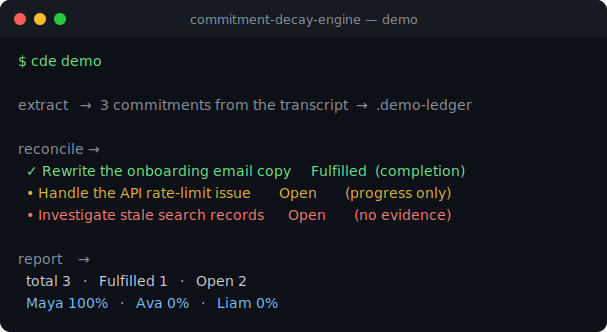

# Commitment Decay Engine

_Supportive accountability for fast-moving teams — turn "I'll handle that" into tracked, gently-followed-up commitments._

[](https://github.com/akira231097/commitment-decay-engine/actions/workflows/ci.yml)


<p align="center">
  
</p>

> 📐 **[Architecture diagram & design deep-dive →](docs/DESIGN.md)**

## Overview

Teams lose a surprising amount of work in the gap between "I'll take care of that" and the ticket nobody ever created. **Commitment Decay Engine** captures the action items people commit to in meetings and chat, stores each one as a plain, human-readable markdown file, and then reconciles those promises against real evidence — tickets, pull requests, and status updates — to see what actually got done.

The guiding idea is in the name: *commitments decay when nobody remembers them*. The engine keeps track without turning follow-through into surveillance. It only marks work as fulfilled when there is clear completion evidence, and when something slips it suggests a **private, empathetic, rate-limited** reminder instead of a public callout. It runs fully offline in demo mode with fictional fixtures — no credentials, no external services.

## Key features

- **Commitment extraction** from speaker-labeled transcripts using a deterministic, conservative parser (only first-person promises count; "we should" and "I already did" are filtered out).
- **Human-readable markdown ledger** — every commitment is one git-diffable, hand-editable `.md` file with a lossless read/write round-trip.
- **Evidence reconciliation** — keyword + actor scoring matches commitments to evidence and marks them fulfilled only when completion language is present.
- **Supportive nudge policy** — minimum age, max-nudge cap, one-nudge-per-day, and escalating-but-kind private message templates.
- **Weekly analytics** — per-person and per-status summaries with fulfillment rates, designed to fix process problems rather than shame people.
- **CLI-first workflow** with an end-to-end `demo` command.
- **Adapter-friendly core** — local-file inputs in the public repo; Slack / Linear / GitHub / Jira / Notion adapters can plug in without touching policy logic.

## Architecture

```text
meeting transcript / chat export
        |
        v
 commitment extractor      (extractor.py)
        |
        v
 markdown commitment ledger (ledger.py)
        |
        v
 evidence reconciliation    (reconcile.py)
        |
        v
 nudge policy + analytics    (nudges.py, analytics.py)
        |
        v
 status update / private nudge / weekly report
```

The package is split into small, single-responsibility modules, orchestrated by an `argparse` CLI exposed as the `cde` command. Policy logic (extraction, reconciliation, nudging, analytics) is kept strictly separate from integrations: the public repo ships only local-file adapters, and the core engine never knows about vendor-specific APIs.

## Tech stack

| Layer            | Technology                                  |
| ---------------- | ------------------------------------------- |
| Language         | Python 3.11+                                |
| CLI              | `argparse` (`cde` entrypoint)               |
| Data model       | `dataclasses` (slotted) + `StrEnum`         |
| Extraction       | Standard-library `re` (regex)               |
| Storage          | Markdown files (git-diffable, lossless I/O) |
| Evidence format  | JSON                                        |
| Tests            | `pytest`                                     |
| Packaging        | `setuptools` via `pyproject.toml`           |

## Project structure

```text
commitment_decay_engine/
  analytics.py      weekly summaries and follow-through patterns
  cli.py            argparse command line interface (cde)
  extractor.py      transcript/chat commitment extraction
  ledger.py         markdown file persistence (render + parse)
  models.py         dataclasses and status enums
  nudges.py         rate limits and private reminder templates
  reconcile.py      evidence matching and status updates
examples/
  sample_transcript.txt
  sample_evidence.json
docs/
  architecture.md
  privacy.md
tests/
  test_extractor.py
  test_ledger.py
  test_nudges.py
  test_reconcile.py
LICENSE
README.md
SECURITY.md
pyproject.toml
```

## Getting started

Requires Python 3.11+.

```bash
git clone https://github.com/akira231097/commitment-decay-engine.git
cd commitment-decay-engine
python3 -m venv .venv
source .venv/bin/activate      # Windows: .venv\Scripts\activate
pip install -e ".[dev]"
```

Run the test suite:

```bash
pytest -q
```

Run the full end-to-end demo (extract → reconcile → report against the bundled fixtures):

```bash
cde demo
```

Or drive the pipeline step by step:

```bash
# Extract commitments from a transcript into a ledger directory
cde extract examples/sample_transcript.txt --ledger .demo-ledger --date 2026-01-14

# List open commitments
cde list --ledger .demo-ledger --status open

# Reconcile against evidence and update statuses
cde reconcile --ledger .demo-ledger --evidence examples/sample_evidence.json

# Generate an analytics report
cde report --ledger .demo-ledger
```

No credentials are needed for any of the above. `.env.example` lists optional adapter variables (all empty) for future integrations only.

## How it works

**Extraction is conservative by design.** `extract_commitments` scans speaker-labeled lines (`Name: utterance`) and keeps an utterance only if it matches a first-person future-intent pattern (`I'll`, `I will`, `I can`, `I am going to`, `Let me`, `I'll handle`) *and* avoids non-commitment hints like `we should` or `i already`. Each kept line yields a `Commitment` with a derived title, a coarse deadline (today / tomorrow / weekday / ISO date), and up to five keywords. The module's docstring is explicit that this deterministic layer can be replaced by an LLM extractor returning the same `Commitment` dataclass — the rest of the pipeline never changes.

**The ledger is deliberately boring.** Each commitment is rendered to a self-contained markdown file keyed by a slugified `date-person-title`, and parsed back via a regex field table for a lossless round-trip. Markdown is easy to audit, diff, edit by hand, and version in git — no database required.

**Reconciliation avoids false positives.** Evidence is scored by keyword/title overlap with a `+2` boost when the evidence actor matches the committed person, and a minimum score of `2` is required before anything matches — there's a dedicated test proving a single shared generic word won't cause a false match. A commitment is only marked **Fulfilled** when the best-matching evidence contains completion language (`done`, `merged`, `shipped`, `deployed`, `resolved`, …); weaker matches are recorded as progress but left **Open**.

**Nudges encode empathy as policy.** `evaluate_nudge` is a pure function gated by a minimum age (default 2 days), a max-nudge cap (default 3), and a one-nudge-per-day limit. Message tone escalates gently with nudge count — the first offers to create a ticket; the last offers to close it out with "no judgment — priorities shift."

**Analytics surface systems, not scapegoats.** `summarize` aggregates the ledger into status counts, per-person fulfillment rates, and a list of open items — intended to reveal process problems (too many verbal commitments, missing ticket creation, unclear owners) rather than to rank individuals.

## Notes / limitations

- The bundled extractor is **regex-based and deterministic by design** — it favors precision and auditability over recall, and is structured as a drop-in seam for an LLM-based extractor.
- The public repo ships only **local-file inputs and fictional fixtures**. Real integrations (Slack, Linear, GitHub, Jira, Notion) are intended to live outside the core as adapters that produce `Commitment` / `EvidenceItem` objects.
- This repo intentionally contains only fictional people and fake evidence links. Do **not** commit real transcripts, private chat exports, customer data, tokens, or internal ticket data. See [docs/privacy.md](docs/privacy.md) and [SECURITY.md](SECURITY.md).

## License

Released under the [MIT License](LICENSE).