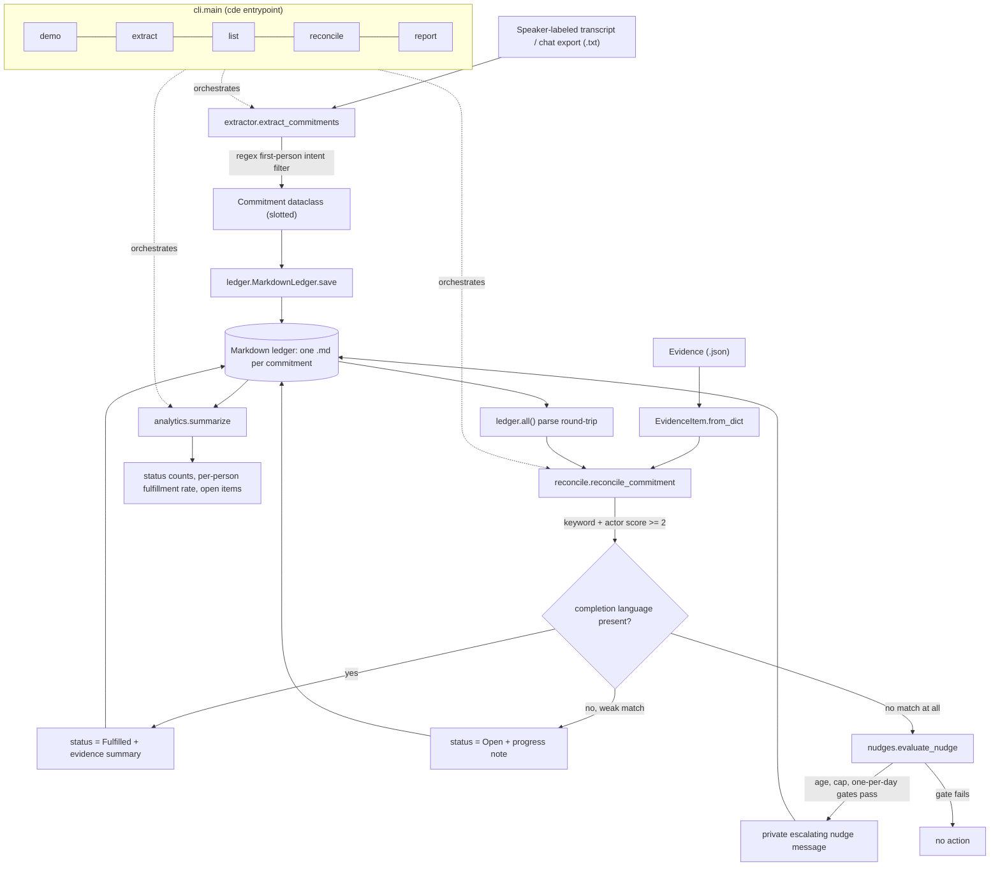

# Commitment Decay Engine — Design Notes

## The problem

Teams lose real work in the silent gap between someone saying "I'll take care of
that" in a meeting and a ticket that never gets created. The verbal commitment
*decays* because nobody is holding a durable record of it. The naive fixes are
both bad: heavyweight project-management ritual that nobody keeps up with, or
surveillance-style bots that publicly shame people the moment a date slips. The
Commitment Decay Engine takes a third path — capture commitments cheaply,
store them somewhere a human can audit and hand-edit, only declare something
"done" when there is hard evidence, and when work slips, send a *private,
rate-limited, kind* reminder instead of a callout.

## The approach

The system is a small, single-responsibility pipeline with policy logic kept
strictly separate from any integration. Three design decisions carry the weight.

### Deterministic extraction as a replaceable seam

`extractor.extract_commitments` is intentionally a regex parser, not an LLM call.
It scans `Name: utterance` lines via `SPEAKER_LINE`, then keeps an utterance only
if it matches a first-person future-intent pattern (`I'll`, `I will`, `I can`,
`I am going to`, `Let me`) **and** dodges a `NON_COMMITMENT_HINTS` blocklist
(`we should`, `i already`, `i fixed`, ...). This is why the sample transcript's
"We should probably improve the dashboard" and "I already fixed the broken signup
link" are both correctly dropped, while Maya's, Ava's, and Liam's first-person
promises are kept. Each kept line becomes a `Commitment` with a derived `title`,
a coarse `deadline` (today / tomorrow / weekday / ISO date), and up to five
deduplicated keywords with stop-words removed. Crucially, the module docstring
declares this layer a drop-in seam: a production LLM extractor can replace it as
long as it returns the same `Commitment` dataclass — the ledger, reconciler,
nudge, and analytics modules never change. The conservative regex favors
*precision and auditability over recall*: it would rather miss a commitment than
fabricate one.

### A lossless markdown ledger instead of a database

`ledger.py` renders every `Commitment` to a self-contained `.md` file named by a
slugified `date-person-title` (capped at 90 chars, generated by the dataclass
`slug` property). `render_commitment` emits a fixed bullet table of `**Field:**
value` lines; `parse_commitment` reads it back through `FIELD_PATTERNS` — a dict
of per-field regexes — reconstructing the dataclass for a lossless round-trip.
Optional fields (`last_nudged`, `fulfilled_date`) are only written when set, and
dates serialize through `isoformat`/`datetime.fromisoformat` with graceful
fallbacks. The payoff is that the entire state of the engine is a directory of
plain text: git-diffable, hand-editable, reviewable in a PR, and free of any
schema-migration or database-server dependency. The whole runtime uses only the
Python standard library.

### Empathy encoded as policy, not vibes

`nudges.evaluate_nudge` is a pure function that turns "be considerate" into
explicit, testable gates: the commitment must still be `OPEN`, must be at least
`min_age_days` old (default 2), must be under the `max_nudges` cap (default 3),
and must not have already been nudged `today`. Only then does `render_nudge`
produce a message whose tone escalates *gently* with `nudge_count` — the first
offers to create a ticket, the last offers to close it out with "No judgment -
priorities shift." `reconcile.reconcile_commitment` is the matching half:
`_best_match` scores each evidence item by keyword/title overlap, adds a `+2`
boost when the evidence `actor` equals the committed `person`, and requires a
minimum score of `2` so a single shared generic word cannot trigger a false
match. A commitment flips to `FULFILLED` only when the winning evidence contains
a word from `FULFILLMENT_HINTS` (`done`, `merged`, `shipped`, `resolved`, ...);
weaker matches are recorded as progress but deliberately left `OPEN`.
`analytics.summarize` then rolls the ledger up into status counts and per-person
fulfillment rates explicitly framed to surface process problems, not to rank
people.

## The key trade-off

The defining trade-off is **precision over recall, paid for in missed
commitments**. The regex extractor and the score-and-completion-language gates
are tuned so the engine almost never invents a commitment or falsely marks one
fulfilled — the property that makes the tool trustworthy enough to act on
people's behalf. The cost is real: phrasings outside the pattern list ("I'll get
on that," implied ownership, second-person assignment) slip through uncaught, and
genuine completions described without an obvious keyword stay `OPEN`. The
architecture accepts this consciously, treating the deterministic layer as a
high-precision floor and exposing the extractor as a clean seam where an
LLM-based adapter can later raise recall without touching the trusted ledger,
reconciliation, and empathy-policy core.